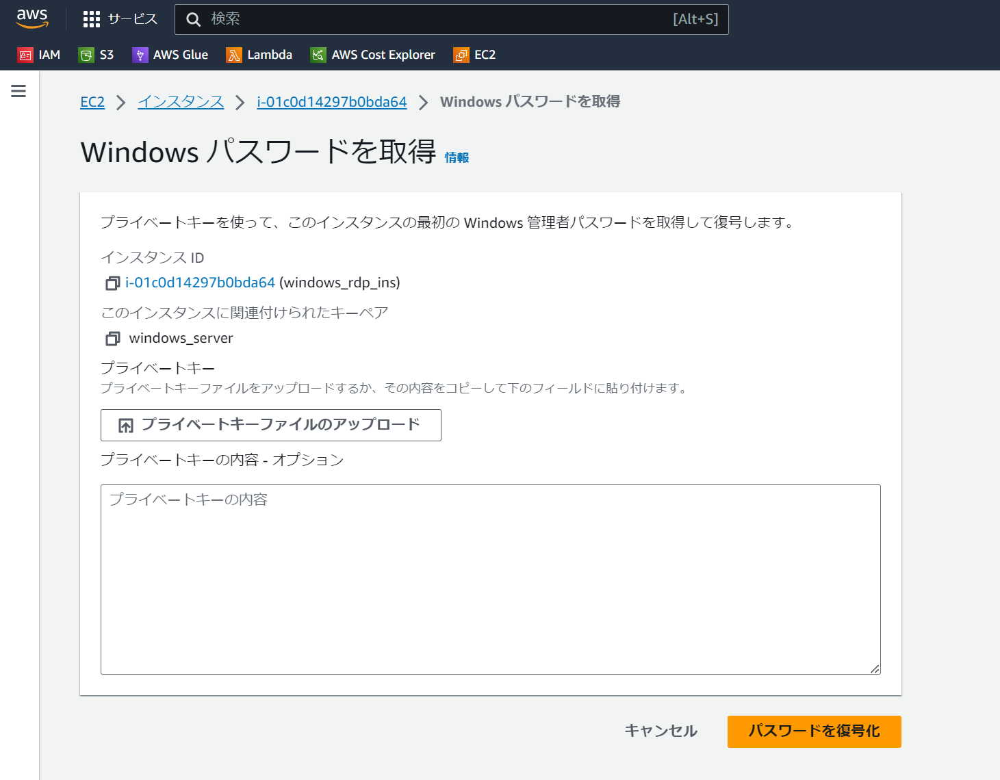
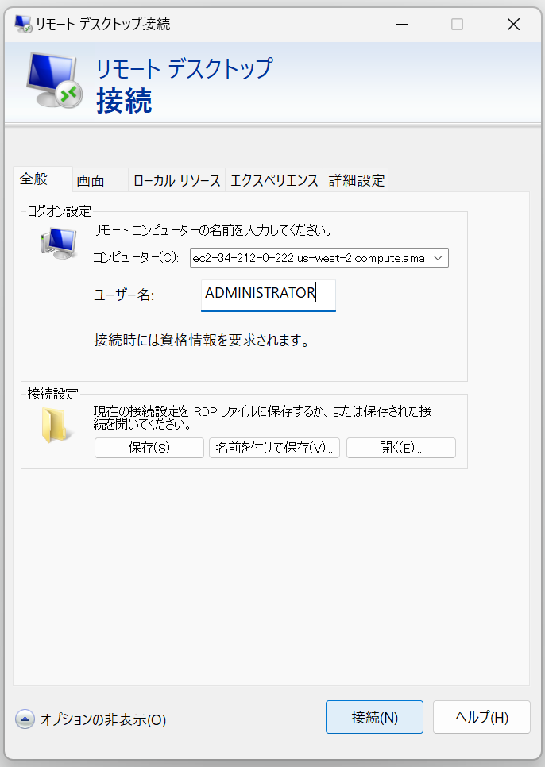
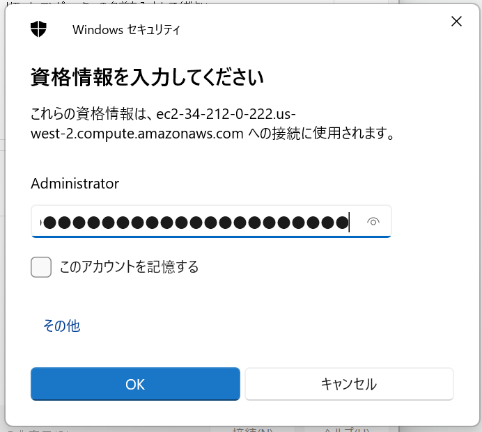
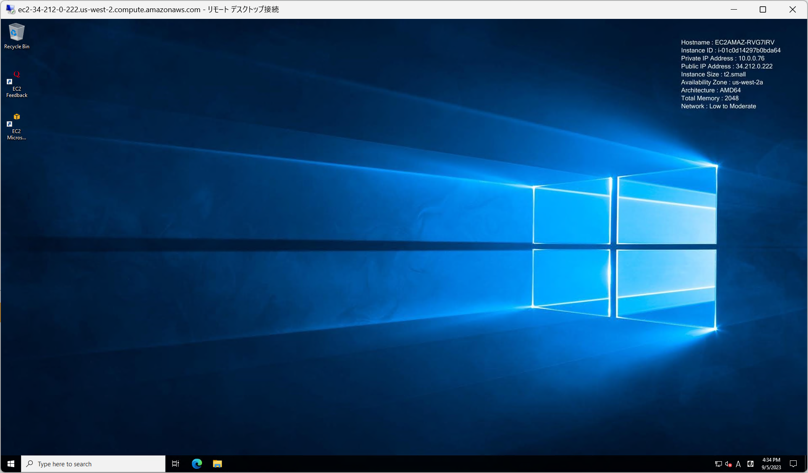
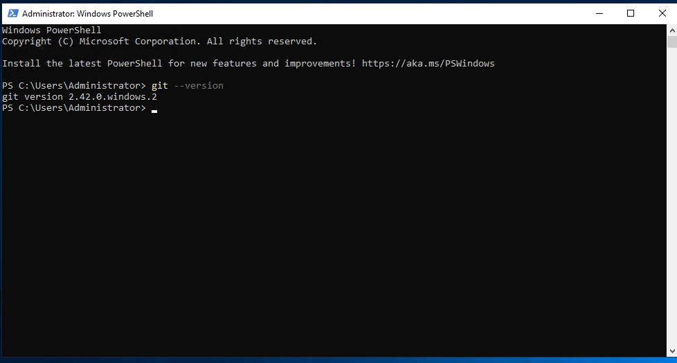
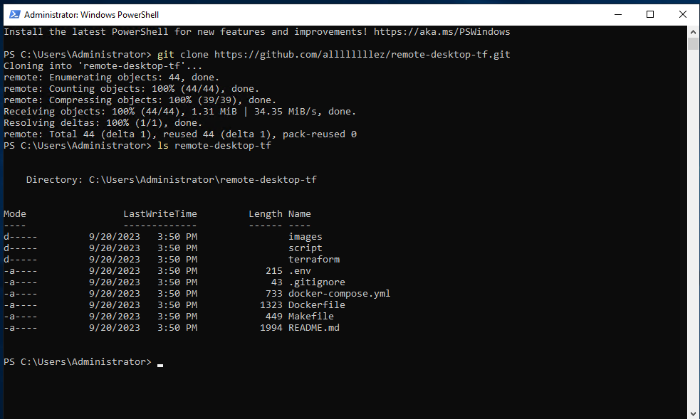
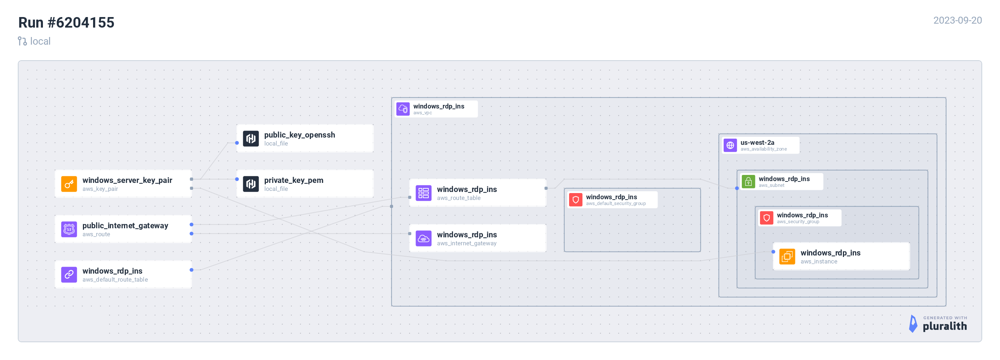

# Run remote desktop instance by Terraform 

Remote Desktop で接続可能な EC2 インスタンス（キーペア付き）+ Security Group をパパっと立てるやつ

## ファイル構成

| ファイル・フォルダ名 | 説明 |
| :- | :- |
| terraform | terraform ソース置き場 |
| script | スクリプト置き場 |
| images | README 用画像 |
| Dockerfile | Terraform 実行環境イメージ設定ファイル |
| docker-compose.yml | Terraform 実行環境コンテナ設定ファイル |

## つかいかた

### 環境変数設定

`.aws/credentials` に、AWSのcredential情報を記載してください

```bash
[default]
export AWS_ACCESS_KEY_ID=<your-access-key>
export AWS_SECRET_ACCESS_KEY=<your-secret-key>
```

(Optional) [Pluralith](https://www.pluralith.com/) を使用して構成図を出す場合、`.env` の `PLURALITH_API_KEY` にAPIキーを指定してください。

### Terraform 実行環境

docker コンテナを起動してください。

起動コマンド例）

```
$ docker compose run \
    --env TF_VAR_my_ip_address="$(curl -s ipinfo.io | jq -r .ip)/32" \
    tf_sandbox
```

※ `TF_VAR_my_ip_address` は `.env` に記載してもOK

### EC2起動

```
~/work/docker_windows_on_ec2/terraform # terraform init
（出力略）
~/work/docker_windows_on_ec2/terraform # terraform apply
```

### インスタンスへ接続（Windows）

Windowsのリモートデスクトップで接続してみます。

パスワードは、「Windows パスワードを取得」で、作成したキーペアを復号して入手します。



AWS CLIでも入手可能。コマンドは[docker_windows_on_ec2/script/get_instance_password.sh](script/get_instance_password.sh)を参照されたい。

```
root@ec1476751abe:~/work/terraform# ../script/get_instance_password.sh
Instance windows_server:
{
  "KeyName": "windows_server",
  "InstanceId": "i-01c0d14297b0bda64",
  "PublicDnsName": "ec2-34-212-0-222.us-west-2.compute.amazonaws.com"
}
Password data:
{
    "InstanceId": "i-01c0d14297b0bda64",
    "PasswordData": "*********************************,
    "Timestamp": "2023-09-05T15:30:58+00:00"
}
```

リモートデスクトップを起動します。
「リモートデスクトップファイルのダウンロード」でRDPショートカットファイルを入手すると、ショートカットを実行するだけでOKになります。

ダウンロードしなくても、上のコマンドで表示した「PublicDNSName」をコピーして、RDPの接続先に指定すればよいです。



接続すると、パスワード入力を要求される。



パスワードを入力して「OK」押下。



接続できた。

### 何かしてみる

user_data でインストールを仕込んでいるので git が使えたりします。





### インスタンスへ接続（Mac OS）

```
$  ssh -i "mac_os_in
stance.id_rsa" ec2-user@ec2-35-92-143-188.us-west-2.c
ompute.amazonaws.com

    ┌───┬──┐   __|  __|_  )
    │ ╷╭╯╷ │   _|  (     /
    │  └╮  │  ___|\___|___|
    │ ╰─┼╯ │  Amazon EC2
    └───┴──┘  macOS Ventura 13.5.2

ec2-user@ip-10-0-0-223 ~ %
```

```tf
vnc_password = "xxxxx"
```

を入力


## EC2 構成図

### Windows インスタンス



